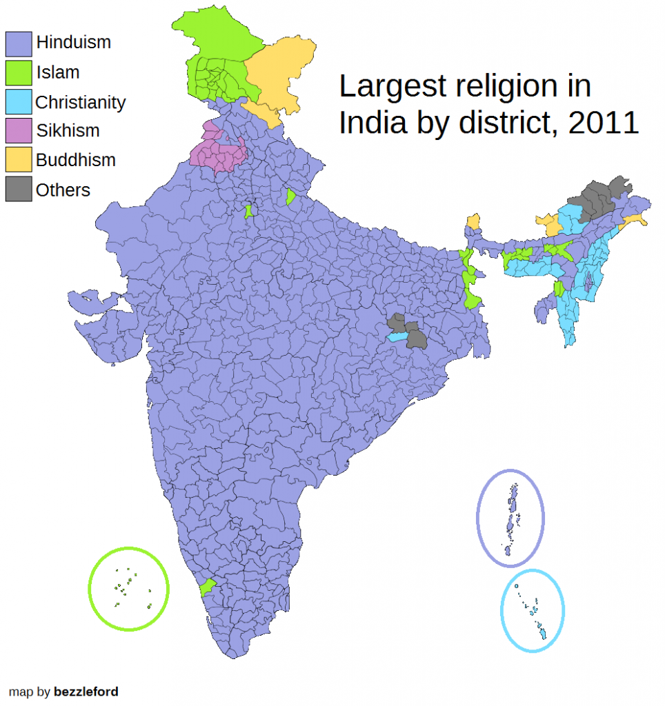

```{r setup, include=FALSE}
knitr::opts_chunk$set(echo = FALSE, message=FALSE, warning=FALSE, fig.align='center', out.width = '80%')
```

```{r import packages and set random seed}
library(tidyverse)
library(ggplot2)
library(maptools)
library(rgeos)
library(ggmap)
library(scales)
library(RColorBrewer)
library(rgdal)
#library(xlsx)
library(gridExtra)
library(sf)
library(rnaturalearth)
library(rnaturalearthdata)
set.seed(42)
```

# Introduction

It is estimated that India will overtake China in recent years to become the most populous country in the world. In China, the demographic situation has changed in recent years and various social problems have become increasingly prominent. As for India, in various news reports, we also know that its population has some different situations from China due to religion, customs, etc. Especially, the problem of gender inequality seems to be more prominent. Therefore, in our small project, we explore and analyze the data indicators and the demographic and gender situation of each state in India, hoping to find some problems and corresponding methods.

# Data Exploration

## World Birth Sex Ratio

The sex ratio at birth is a good measure of regional gender inequality. To get a better understanding of gender inequality in India, we first look at the sex ratio at birth around the world in 2020. In this case, we used 1 to represent females and the male ratio is shown in the chart (ignoring LGBTI). We can see that more than 75% of the world has an average sex ratio (male ratio < 1:050), but India is slightly different. India's sex ratio is 1:1085. This data will reflect some generational and cultural context, which we can find out later.

```{r import data}
world <- ne_countries(scale = "medium", returnclass = "sf")
world <- world[-c(12), ]
world_birth_ratio <- read.csv("data/world_birth_ratio/API_SP.POP.BRTH.MF_DS2_en_csv_v2_4523453.csv")
world_birth_ratio <- world_birth_ratio[c("Country.Code", "X2020")]
names(world_birth_ratio)[1] <- "adm0_a3"
world <- merge(world, world_birth_ratio, by="adm0_a3", all.x=TRUE)
ggplot(data = world) +
    geom_sf(aes(fill = X2020)) +
    scale_fill_viridis_c(name="Birth sex ratio", option = "plasma" , trans = "sqrt")+
    labs(title="World birth sex ratio in 2020") +
    theme(plot.title=element_text(hjust=0.5))
```

## Religion Reasons

When we mention the issue of sex ratio at birth in India, we tend to associate it with religious reasons. Therefore, we looked up the regional breakdown of religion in India in 2011 from reddit (https://www.reddit.com/r/MapPorn/comments/5r7gt7/largest_religion_by_district_in_india_2011_census/) and the original data from 2011 Census. Statistical method: The most people with religion in that region is calculated and that religion is taken as 100% of that region. From the graph, we found that 80% of Indians follow Hinduism and the rest are Islam, Buddhism, Sikhism, Christianity and others.

<center>
{width=300, height=330}
</center>

For a better analysis of religion, we obtained from the World Bank and UN websites (https://data.worldbank.org/indicator/SP.POP.BRTH.MF?end=2020&start=2020&type=shaded&view=map
https://data.un.org/Data.aspx?d=PopDiv&f=variableID%3A52) to obtain the birth sex ratio of past 5 years in 2016 and 2021 by state in India and plotted as follows ((where the data for the map was obtained from https://gadm.org/download_ country.html)).

```{r import India map and state data}
india_state_shape <- readShapePoly("data/India_map/IND_adm1")
state_data <- read.csv("data/RBI DATA states_wise_population_Income.csv")
names(state_data)[2] <- "NAME_1"
fortify_shape <- fortify(india_state_shape, region = "ID_1")
india_state_shape_with_data <- merge(fortify_shape, state_data, by="id", all.x=TRUE)
india_state_shape_with_data <- india_state_shape_with_data[order(india_state_shape_with_data$order), ]
```

We find that the sex ratio at birth still varies significantly across states, for example, in 2011-2016, Kerala is significantly better than other states. Overall, the sex ratio at birth is more balanced in the South and Northeast. This suggests that state differences other than religion also play a role in population inequality in India.

```{r bieth sex ratio of past 5 years in 2016 and 2021}
plot1 <- ggplot() +
  geom_polygon(data = india_state_shape_with_data,
           	aes(x = long, y = lat, group = group, fill = BIRTH_SEX_PAST5_2016),
                color = "White", size = 0.3) +
  coord_map()+
  scale_fill_distiller(name="Birth sex ratio", palette = "Spectral" , breaks = pretty_breaks(n = 7))+
  theme_nothing(legend = TRUE)+
  labs(title="Birth sex ratio of past 5 years--2016")

plot2 <- ggplot() +
  geom_polygon(data = india_state_shape_with_data,
           	aes(x = long, y = lat, group = group, fill = BIRTH_SEX_PAST5_2021),
                color = "White", size = 0.3) +
  coord_map()+
  scale_fill_distiller(name="Birth sex ratio", palette = "Spectral" , breaks = pretty_breaks(n = 4))+
  theme_nothing(legend = TRUE)+
  labs(title="Birth sex ratio of past 5 years--2021")

grid.arrange(plot1, plot2, ncol=2)
```


## State Wise Data

To explore further reasons for this, we took data from HANDBOOK OF STATISTICS ON INDIAN STATES (https://www.rbi.org.in/Scripts/AnnualPublications.aspx?head=Handbook+of+ Statistics+on+Indian+States) to collect data from the 2011 census, including rainfall, agriculture, total population, and poverty rates for each state in India. These data are manually added to the dataset one by one. From this, we hope to obtain the reasons for the geographic disparities in gender inequality in India. The following is a visualization and description of these data. For the state of Telangana, data from Andhra Pradesh will be used since it was separated from Andhra Pradesh only in 2014.

### Rainfall and Agricultural Production

The main rainfall in India in 2011 is concentrated in the southwest, respectively Maharashtra (5000mm) and Karnataka (4000mm). There is an obvious trend for milk production in India in 2011. As the Uttar Pradesh takes the major milk production duty as 20,000 tons. And the rest of the major milk products are in the east-southern region, around 7000 - 12000 tons. The regions that produce most rice are Punjab, which has over 3500 tons and rest has most region are southern area, has around 2500 tons.

```{r rainfall, out.width="50%"}
plot3 <- ggplot() +
  geom_polygon(data = india_state_shape_with_data,
           	aes(x = long, y = lat, group = group, fill = X2011_Rainfall),
                color = "White", size = 0.3) +
  coord_map()+
  scale_fill_distiller(name="Rainfall", palette = "Spectral" , breaks = pretty_breaks(n = 7))+
  theme_nothing(legend = TRUE)+
  labs(title="Rainfall")

plot3
```

```{r agriculture}
plot4 <- ggplot() +
  geom_polygon(data = india_state_shape_with_data,
           	aes(x = long, y = lat, group = group, fill = X2011_Milk_production),
                color = "White", size = 0.3) +
  coord_map()+
  scale_fill_distiller(name="Milk Production", palette = "Spectral" , breaks = pretty_breaks(n = 7))+
  theme_nothing(legend = TRUE)+
  labs(title="Milk Production")

plot5 <- ggplot() +
  geom_polygon(data = india_state_shape_with_data,
           	aes(x = long, y = lat, group = group, fill =  Rice_production0),
                color = "White", size = 0.3) +
  coord_map()+
  scale_fill_distiller(name="Rice Production", palette = "Spectral" , breaks = pretty_breaks(n = 7))+
  theme_nothing(legend = TRUE)+
  labs(title="Rice Production")
```

```{r}
grid.arrange(plot4,plot5, ncol=2)
```

### Sociological Features

We considered the total population, average income, poverty rate, literacy rate and unemployment rate, which are as follows.

The total population in India has a trend, most of the people live in southwest India, on average 100,000 people live in each region. but there is one exception that happens in Uttar Pradesh, which has the most people living in that region, since it is the capital of India.

```{r population, out.width="50%"} 
ggplot() +
  geom_polygon(data = india_state_shape_with_data,
           	aes(x = long, y = lat, group = group, fill = X2011..POP),
                color = "White", size = 0.3) +
  coord_map()+
  scale_fill_distiller(name="Total population", palette = "Spectral" , breaks = pretty_breaks(n = 7))+
  theme_nothing(legend = TRUE)+
  labs(title="Total population--2011")
```

There is not much difference between income of India in 2011 over 95% percent region in India has around $40000 - $100,000(INR), while the Bihar is the region people who have the lowest Income. Poverty rates in India in 2011 mainly focus on the middle and east region, which is around 25% to 35%, while Chattisgarh has the highest, which is 40%. From the two plots, it appears that overall higher income regions have lower poverty rates.

```{r income and poverty}
plot6 <- ggplot() +
  geom_polygon(data = india_state_shape_with_data,
           	aes(x = long, y = lat, group = group, fill = X2011.12.INC),
                color = "White", size = 0.3) +
  coord_map()+
  scale_fill_distiller(name="Income", palette = "Spectral" , breaks = pretty_breaks(n = 7))+
  theme_nothing(legend = TRUE)+
  labs(title="Income--2011")

plot7 <- ggplot() +
  geom_polygon(data = india_state_shape_with_data,
           	aes(x = long, y = lat, group = group, fill = X2011..Poverty),
                color = "White", size = 0.3) +
  coord_map()+
  scale_fill_distiller(name="Poverty rate", palette = "Spectral" , breaks = pretty_breaks(n = 7))+
  theme_nothing(legend = TRUE)+
  labs(title="Poverty rate--2011")
```

```{r}
grid.arrange(plot6,plot7,ncol=2)
```

There is quite a different Literacy rate in 2011 in India, which has a wide range from 65% to 90%. and the distribution does not have an identifiable pattern, while Goa has the lowest Literacy rate (65%), and Maharashtra has the highest literacy ratio (90%). Poverty rates in India in 2011 mainly focus on the middle and east region, which is around 25% to 35%, while Chattisgarh has the highest, which is 40%.
 
```{r lit, out.width="50%"}
ggplot() +
  geom_polygon(data = india_state_shape_with_data,
           	aes(x = long, y = lat, group = group, fill = X2011..LIT),
                color = "White", size = 0.3) +
  coord_map()+
  scale_fill_distiller(name="Literacy rate", palette = "Spectral" , breaks = pretty_breaks(n = 7))+
  theme_nothing(legend = TRUE)+
  labs(title="Literacy rate--2011")
```

Unemployment rate in India in 2011 is different based on the region, in the midwest and west. The rate is quite low, about 10 to 20 per thousand, while in the east and north, the unemployment rate increases, which is from 35 to 50 per thousand.

```{r unemp, out.width="50%"} 
 
ggplot() +
  geom_polygon(data = india_state_shape_with_data,
           	aes(x = long, y = lat, group = group, fill = X2011..UNEMP),
                color = "White", size = 0.3) +
  coord_map()+
  scale_fill_distiller(name="Unemployment rate", palette = "Spectral" , breaks = pretty_breaks(n = 7))+
  theme_nothing(legend = TRUE)+
  labs(title="Unemployment rate--2011")
```


# Simple Analysis

We start to find the correlation between the gender ratio and other factors in India. Even though the correclation coefficient is in -1 and 1, which shows there exists a partial relationship between them and gender ratio. But the pre-value for all the features we indicated here milk production, rice production, 2011 income, poverty and LIT are all higher than 0.05, which refused the hypothesis. 

```{r read state data2}
state_data2 <- read.csv("data/RBI DATA states_wise_rice_milk_sex.csv")
names(state_data2)[2] <- "NAME_1"
```

```{r draw the relationship between the sex and milk}
r <- round(cor(state_data2$X2011..SEX_Ratio, state_data2$Milk_production), 2)
p <- cor.test(state_data2$X2011..SEX_Ratio, state_data2$Milk_production)$p.value
plot_1<-ggplot(state_data2, aes(y=X2011..SEX_Ratio, x=Milk_production)) + 
  geom_point() + 
  geom_smooth(method="lm", col="black") + ylim(800,1100)+
  annotate("text", x=17000, y=1020, label=paste0("r = ", r), hjust=0) +
  annotate("text", x=17000, y=1050, label=paste0("p = ", round(p, 3)), hjust=0) +labs(x='Milk Production',y='SEX RATIO')+ ggtitle("Relationship Between Sex Ratio and Milk Production")+
  theme_classic()
```

```{r read state data3}
state_data3 <- read.csv("data/RBI DATA states_wise_rice_sex.csv")
names(state_data3)[2] <- "NAME_1"
```

```{r draw the relationship between the sex and rice}
r <- round(cor(state_data3$X2011..SEX_Ratio, state_data3$Rice_production1), 2)
p <- cor.test(state_data3$X2011..SEX_Ratio, state_data3$Rice_production1)$p.value
plot_2 <- ggplot(state_data3, aes(y=X2011..SEX_Ratio, x=Rice_production1)) + 
  geom_point() + 
  geom_smooth(method="lm", col="black") + ylim(800,1100)+xlim(1000,6000)+
  annotate("text", x=5000, y=1000, label=paste0("r = ", r), hjust=0) +
  annotate("text", x=5000, y=1050, label=paste0("p = ", round(p, 3)), hjust=0) +labs(x='Rice Production',y='SEX RATIO')+ ggtitle("Relationship Between Sex Ratio and Rice Production")+
  theme_classic()
```


```{r draw the relationship between the sex and income}
r <- round(cor(state_data$X2011..SEX_Ratio, state_data$X2011.12.INC), 2)
p <- cor.test(state_data$X2011..SEX_Ratio, state_data$X2011.12.INC)$p.value
plot_3 <-ggplot(state_data, aes(y=X2011..SEX_Ratio, x=X2011.12.INC)) + 
  geom_point() + 
  geom_smooth(method="lm", col="black") +ylim(700,1200)+xlim(10000,220000)+
  annotate("text", x=160000, y=1100, label=paste0("r = ", r), hjust=0) +
  annotate("text", x=160000, y=1150, label=paste0("p = ", round(p, 3)), hjust=0) +labs(x='Income',y='SEX RATIO')+ ggtitle("Relationship Between Sex Ratio and Income")+
  theme_classic()
```


```{r draw the relationship between the sex and Poverty}
r <- round(cor(state_data$X2011..SEX_Ratio, state_data$X2011..Poverty), 2)
p <- cor.test(state_data$X2011..SEX_Ratio, state_data$X2011..Poverty)$p.value
plot_4<-ggplot(state_data, aes(y=X2011..SEX_Ratio, x=X2011..Poverty)) + 
  geom_point() + 
  geom_smooth(method="lm", col="black") +ylim(700,1200)+
  annotate("text", x=30, y=1100, label=paste0("r = ", r), hjust=0) +
  annotate("text", x=30, y=1150, label=paste0("p = ", round(p, 3)), hjust=0) +labs(x='Poverty Rate',y='SEX RATIO')+ ggtitle("Relationship Between Sex Ratio and Poverty Rate")+
  theme_classic()
```

```{r draw the relationship between the sex and lit }
r <- round(cor(state_data$X2011..SEX_Ratio, state_data$X2011..LIT), 2)
p <- cor.test(state_data$X2011..SEX_Ratio, state_data$X2011..LIT)$p.value
plot_5 <-ggplot(state_data, aes(y=X2011..SEX_Ratio, x=X2011..LIT)) + 
  geom_point() + 
  geom_smooth(method="lm", col="black") +ylim(700,1200)+xlim(60,100)+
  annotate("text", x=85, y=1100, label=paste0("r = ", r), hjust=0) +
  annotate("text", x=85, y=1150, label=paste0("p = ", round(p, 3)), hjust=0) +labs(x='Literacy Rate',y='SEX RATIO')+ ggtitle("Relationship Between Sex Ratio and Literacy Rate")+
  theme_classic()
```

```{r echo=FALSE,fig.width=7,fig.height=8}
grid.arrange(plot_1,plot_2,plot_3,plot_4,plot_5,top = "Try to Find the Relationship with Sex Ratio")
```
```{r}
library(readxl)
data_state5 <-read_excel("data/sex_ratio_age.xlsx",sheet =1)
```

Based on the first two questions, We have completed the presentation of the general situation of each states and explored the correlation between the sex ratio and the various factors. We now wish to further our understanding of the age distribution of males and females in India in selected states.

The age distribution of females and males in India is displayed in the following graph. As we can see the regress of the males and females, above 7 has occupied the most, while 0-6 as only a little, and ratio between 0-6 and above 7 is 1:10.

```{r echo=FALSE}
ggplot(data_state5,aes(x=State,y=value,fill=Type))+
  geom_bar(stat = 'identity',
           position = 'fill')+
  geom_text(aes(label=value), size=4,  
            position = position_fill(vjust = 0.5))+
  labs(x=NULL,y='Proprotin of Value')+ 
  theme_bw(base_size = 15)+  
  theme(axis.text = element_text(colour = 'black')) +
  scale_x_discrete(guide = guide_axis(n.dodge = 2))
```


This is a fold and box plot of sex ratio in India from 1951 to 2011 with the remaining indicators for Assam, Bihar, Dadra and Nagar, Karnataka, Kerala and all. It shows an upward trend in essentially all categories. The box plot shows that there is a tendency for the sex ratio profile to approach gradually over time in all states of India.

```{r}
state_data4 <- read.csv("data/sex_ratio.csv")
state_data4 <- state_data4 %>% mutate(X1951 = as.integer(X1951))
state_sex_ratio_trans <- read.csv("data/sex_ratio_trans.csv")
state_sex_ratio_trans <- state_sex_ratio_trans %>% mutate(Arunachal.Pradesh = as.integer(Arunachal.Pradesh))
```

```{r}
par(bg = '#F5F5F5')
boxplot(state_data4$X1951, state_data4$X1961, state_data4$X1971, state_data4$X1981,state_data4$X1991,  state_data4$X2001, state_data4$X2011, 
        main = "Sex ratio", names = c(1951,1961,1971,1981,1991,2001,2011),outline=FALSE,boxwex=0.2)
lines(state_sex_ratio_trans$ALL.INDIA, type="b",frame = FALSE, pch = 19, col = "#FF1793", lwd=2)
lines(state_sex_ratio_trans$Assam, type="b", frame = FALSE, pch = 19, col = "#FF0000", lwd=2)
lines(state_sex_ratio_trans$Bihar, type="b", frame = FALSE, pch = 19, col = "#FF7B08", lwd=2)
lines(state_sex_ratio_trans$Dadra.and.Nagar.Haveli, type="b", frame = FALSE, pch = 19, col = "#FFEF45", lwd=2)
lines(state_sex_ratio_trans$Karnataka, type="b", frame = FALSE, pch = 19, col = "#81FF6E", lwd=2)
lines(state_sex_ratio_trans$Kerala, type="b", frame = FALSE, pch = 19, col = "#4000FF", lwd=2)
legend("topleft",legend=c("All India", "Assam", "Bihar", "Dadra&Nagar_H", "Karnataka", "Kerala"),
       col=c("#FF1793", "#FF0000", "#FF7B08", "#FFEF45", "#81FF6E", "#4000FF"), lty = 1, cex=0.5) 
```

# Conclusion
In this project, we first noticed the specificity of the gender ratio issue in India in the global context. Further exploration revealed that the gender ratio and gender equality issues are not the same in all states of India. We then subdivided our exploration of the broad direction of 'Sex Ratios in India' into four sub-themes as follows.

(1) An overview of the overall situation in each state of India. The data collected is presented in the form of maps showing the social, economic, cultural and environmental conditions of each state in terms of food production, income, sex ratio and rainfall et.

(2) To explore the relationship between sex ratio and other factors and to test their correlation through hypothesis testing. In this section, we find that the relationship between sex ratio and other variables is not very strong. However, this further suggests that the sex issue is a complex social phenomena, the causes of which cannot be directly attributed to any single one factor.

(3) Based on the first two questions, we went on to explore the age distribution of males and females in India in selected states, which is important for understanding the current age composition of males and females in India and the relative proportions of each age group, as well as helping us to predict the future gender ratio.

(4) Finally, we have analysed the relationship between sex ratios over time in selected states of India and also compared it with the all-India average.

Based on these four analyses, we show the overall picture for each state, analyse the relationship between each factor and the sex ratio, compare the age distribution of the sexes and plot the sex ratios over time. It helped us to better understand the specific issue of 'Sex Ratio in India', and also strengthened our ability to ask questions and analyse them.


# Open Questions
Due to the limitations of time and the data available, we have not been very thorough in exploring the issue of 'Sex Ratio in India'. Given more time and the availability of relevant data, we would like to explore further the following questions.

(1) Under the existing system, gender equality is analysed qualitatively. We could try to develop models that describe this issue more concretely, taking into account a variety of factors such as sex ratio, sex-age distribution and economic level. (This problem involves building the model and fitting it.)

(2) Predict future changes in the number of men and women in India based on the existing sex-age distribution, the total population of India and also the current sex ratio.
